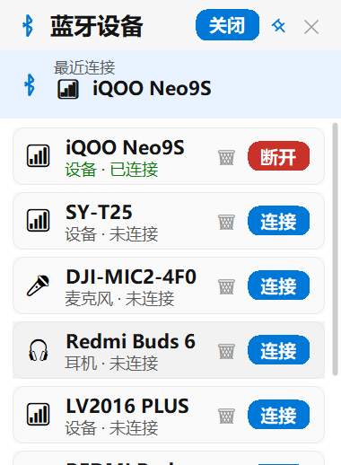

<p align="center">
  
</p>

<h1 align="center">KmaoLink</h1>

<p align="center">
  轻量级 Windows 蓝牙管理悬浮窗工具<br/>
  一键开关蓝牙 · 快速切换设备 · 开机自启
</p>

<p align="center">
  <a href="https://github.com/zk26/KmaoLink/releases/latest"></a>
  
  
  <a href="LICENSE"></a>
</p>

---

## 下载

> **[点击下载最新版 KmaoLink.exe](https://github.com/zk26/KmaoLink/releases/latest)** — 无需安装，双击即运行（需 [.NET 8.0 Runtime](https://dotnet.microsoft.com/download/dotnet/8.0)）

## 预览

<!-- 替换成你的截图 -->
<p align="center">
  
</p>

## 功能

| 功能 | 说明 |
|------|------|
| 蓝牙开关 | 一键开启/关闭蓝牙 |
| 设备管理 | 显示已配对设备，快速连接/断开 |
| 悬浮窗 | 始终置顶，窗口位置自动记忆 |
| 开机自启 | 右键托盘图标即可设置 |
| 状态指示 | 蓝牙开启时图标彩色，关闭时灰色 |
| 多版本兼容 | Windows 10/11 原生 API，Windows 7/8 命令行工具 |

## 使用

1. 双击运行 `KmaoLink.exe`
2. 屏幕右下角出现蓝牙悬浮窗
3. 点击 **「开启」** 按钮打开蓝牙
4. 在设备列表中点击 **「连接」/「断开」** 管理设备
5. 右键系统托盘图标可设置开机自启

## 编译

```bash
git clone https://github.com/zk26/KmaoLink.git
cd KmaoLink
dotnet publish -c Release -r win-x64 --self-contained false
```

产物：`bin/Release/net8.0-windows10.0.19041.0/win-x64/publish/KmaoLink.exe`

## 兼容性

| 系统 | 方式 | 说明 |
|------|------|------|
| Windows 10/11 | 原生 API | 功能完整 |
| Windows 7/8 | bluetoothCL.exe | 需下载 [bluetoothCL](https://www.nirsoft.net/utils/bluetooth_command_line.html) 放在程序同目录 |

## 配置

设置保存在 `%AppData%/KmaoLink/settings.json`

```json
{
  "WindowX": 1860,
  "WindowY": 1020,
  "AutoStart": true,
  "StartMinimized": true,
  "RefreshInterval": 5000
}
```

## 注意

1. 部分功能需要 **管理员权限** 才能控制蓝牙硬件
2. 首次运行如被 Windows Defender 拦截，选择「仍要运行」
3. 权限问题：右键 exe → 属性 → 勾选「以管理员身份运行」

## 项目结构

```
KmaoLink/
├── .github/workflows/build.yml   # CI/CD 自动编译发布
├── KmaoLink.csproj               # 项目配置
├── Program.cs                    # 入口
├── MainForm.cs                   # 主窗体
├── BluetoothManager.cs           # 蓝牙管理核心
├── AutoStartManager.cs           # 开机自启
├── SettingsManager.cs            # 设置管理
├── Theme.cs                      # 主题样式
├── logo.png                      # 应用图标
└── logo.ico                      # exe 图标
```

## License

[MIT](LICENSE)
